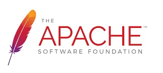

# Evolución de Apache http Server.

El servidor Apache lleva con nosotros la friolera de 30 años, por lo que en la actualidad es considerada una aplicación muy robusta y madura. Esta ha sido su evolución.

La historia del servidor Apache comienza en 1995, cuando un grupo de desarrolladores, liderados por **Roy T. Fielding**, se unieron para crear un servidor web más eficiente y flexible que el **NCSA HTTPd**, el software dominante en la época. Basándose en el código del NCSA, este grupo, que se autodenominó `El Grupo Apache`, desarrolló la primera versión de **Apache HTTP Server**, **Apache 1.0**, publicada en diciembre de 1995.

En menos de un año, Apache ya había superado al NCSA en términos de cuota de mercado, gracias a sus características superiores, como:

- ***Mayor seguridad y estabilidad:*** Apache se diseñó desde el principio con la seguridad en mente, lo que le convirtió en una opción más atractiva que el NCSA, que era conocido por sus vulnerabilidades.

- ***Mejor rendimiento y escalabilidad:*** Apache podía manejar un mayor número de conexiones y solicitudes que el NCSA, lo que lo hacía ideal para sitios web con un alto volumen de tráfico.

- ***Flexibilidad y modularidad:*** Apache se diseñó como un sistema modular, lo que permitía a los administradores de servidores añadir y eliminar funcionalidades según sus necesidades. Este concepto de modularidad es ***crítico*** y será desarrollado en profundidad más adelante.

- ***Código abierto y gratuito:*** Apache se distribuía bajo la Licencia Apache, una licencia de código abierto que permite a cualquiera usar, modificar y distribuir el software de forma gratuita.

Los años siguientes fueron de rápido crecimiento y consolidación para Apache. Se lanzaron nuevas versiones con mejoras significativas, como:

- ***Apache 1.1 (1996)***: Soporte para CGI, SSL y IPv6.

- ***Apache 1.2 (1997)***: Soporte para mod_rewrite, una herramienta fundamental para la gestión de URLs, que deberás aprender a usar en el curso.
- ***Apache 1.3 (1998)***: Soporte para JServ, Tomcat y AJP.

En 1999, se creó la `Apache Software Foundation` (ASF) para proporcionar un marco legal y financiero para el desarrollo del proyecto Apache. La ASF es una organización sin ánimo de lucro que apoya a una comunidad global de miles de voluntarios que trabajan en una amplia gama de proyectos de código abierto, incluyendo Apache HTTP Server.

La década del 2000 estuvo marcada por la innovación y la expansión del ecosistema Apache. Se lanzaron nuevas versiones del servidor con características revolucionarias, como:

- ***Apache 2.0 (2000)***: Soporte para multiprocesamiento, IPv6 y mod_security.

- ***Apache 2.2 (2005)***: Soporte para WebDAV, HTTP/2 y mod_proxy.

- ***Apache 2.4 (2011)***: Soporte para HTTP/2 Server Push, OCSP Stapling y TLS 1.2.

Además del servidor web, la ASF también alberga otros proyectos de software de gran éxito, como:**

- ***Tomcat***: Servidor de aplicaciones web Java.
- ***Maven***: Herramienta de gestión de proyectos para Java.
- ***Subversion*** Sistema de control de versiones.

En la última década, Apache ha consolidado su posición como el servidor web más popular del mundo, ***con una cuota de mercado superior al 60%***. Las últimas versiones del servidor se han centrado en mejorar la seguridad, el rendimiento y la escalabilidad.

- ***Apache 2.4.48 (2023)***: Mejoras en la seguridad y correcciones de errores.
- ***Apache 2.4.50 (2023)***: Soporte para HTTP/3 y QUIC.

El servidor Apache ha jugado un papel fundamental en el desarrollo de la web. Su código abierto, su flexibilidad y su comunidad global de desarrolladores lo han convertido en la opción preferida para millones de sitios web, desde pequeños blogs personales hasta grandes empresas y organizaciones.

[https://httpd.apache.org/](https://httpd.apache.org/)

