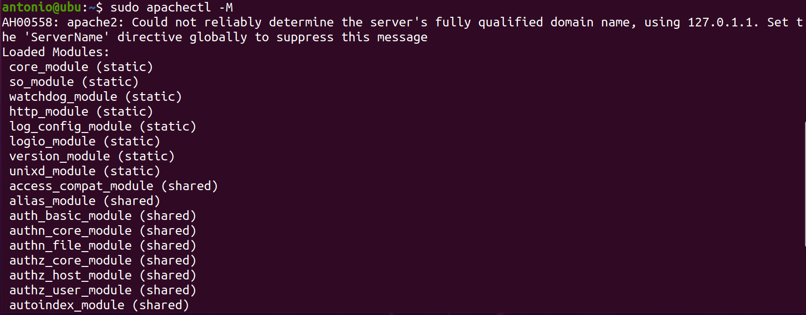
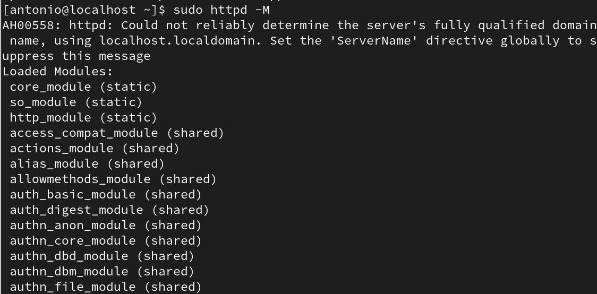

# Archivos de configuración de Apache.

El servidor Apache se configura mediante archivos. Estos archivos se ubican y cambian de nombre en función de la distribución de Linux utilizada, aunque su finalidad y cometido es la misma.

Por lo tanto, en primer lugar debemos tener en cuenta lo siguiente. 

* Para las distribuciones basadas en ***Debian/Ubuntu***, el directorio principal donde se encuentran estos archivos es `/etc/apache2`.

* Para las basadas en ***Red Hat/CentOS***, el directorio es `/etc/httpd/conf`.


## El archivo de configuración principal de Apache.

Para ***Debian/Ubuntu***, el archivo es `/etc/apache2/apache2.conf`. Para ***Red Hat/CentOS*** es `/etc/httpd/conf/httpd.conf`. En ambos casos contiene las configuraciones generales de Apache. Incluye configuraciones como los puertos en los que Apache escucha, los usuarios y grupos con los que se ejecuta Apache, directivas globales de servidor y más. Es el punto de entrada para la configuración de Apache.


## Otros archivos de configuración.

Como iremos aprendiendo, existen otros archivos donde podemos establecer configuraciones en Apache. A diferencia del archivo de configuración principal, estos son archivos que mantienen configuraciones concretas, muy especializadas. Estos son:

* ***ports.conf***: Este archivo define los puertos en los que Apache escucha las solicitudes entrantes. Por defecto, escucha en el puerto `80` para HTTP y en el puerto `443` para HTTPS (si está habilitado). Aquí se pueden cambiar los puertos si es necesario.

* ***sites-available/***: En este directorio se encuentran los archivos de configuración de los distintos sitios web disponibles en el servidor. Cada archivo dentro de este directorio, se corresponde con un sitio web y define la configuración específica para ese sitio, como el directorio raíz del sitio, la configuración de host virtual (VirtualHost), opciones de seguridad y más.

* ***sites-enabled/***: Este directorio contiene enlaces simbólicos a los archivos de configuración de los sitios disponibles que están activos. Cuando se habilita un sitio web, se crea un enlace simbólico desde ***sites-enabled/*** al archivo de configuración correspondiente en ***sites-available/***.

* ***mods-available/***: Aquí se encuentran los archivos de configuración de los módulos disponibles para Apache. Cada archivo corresponde a un módulo específico, como ***rewrite***, ***ssl***, ***php***, etc. que serán explicados más adelante.

* ***mods-enabled/***: Al igual que con los sitios web, este directorio contiene enlaces simbólicos a los archivos de configuración de los módulos que están activos.

* ***conf-available/***: Contiene archivos de configuración adicionales que pueden ser incluidos en la configuración principal de Apache.

* ***conf-enabled/***: Similar a ***mods-enabled/*** y ***sites-enabled/***, este directorio contiene enlaces simbólicos a los archivos de configuración que están activos.

## Sintaxis de los archivos de configuración.

Toda la información que vas a aprender aquí se aplican a los archivos de configuración. A modo de resumen, debemos tener en cuenta que:

* Los archivos de configuración de Apache contienen una directiva por línea. El backslash `\` se puede utilizar como el último carácter en una línea para indicar que la directiva continúa en la siguiente línea. No debe haber otros caracteres o espacios en blanco entre el backslash y el final de la línea.

* Los argumentos de las directivas están separados por `espacios en blanco`. Si un argumento contiene espacios, debemos encerrar ese argumento entre comillas. 

* Las directivas en los archivos de configuración no distinguen entre mayúsculas y minúsculas, pero los argumentos de las directivas a menudo sí son sensibles a las mayúsculas y minúsculas.

* Las líneas que comienzan con el carácter de almohadilla `#` se consideran comentarios y se ignoran. Los comentarios no pueden incluirse en una línea después de una directiva de configuración.

* Las líneas en blanco y el espacio en blanco que ocurre antes de una directiva se ignoran, por lo que podemos indentar las directivas para mayor claridad.

* Los valores de las variables definidas con `DEFINE` o `variables de entorno de la shell` pueden ser utilizados en los archivos de configuración usando la sintaxis `${VAR}`, donde ***VAR*** es el nombre de una variable válida. El valor de esa variable se sustituye en ese lugar en la línea del archivo de configuración, y el procesamiento continúa como si ese texto se encontrara directamente en el archivo de configuración. 

* Las variables definidas con `DEFINE` tienen prioridad sobre las variables de entorno de la shell. Si no se encuentra la variable ***VAR***, los caracteres `${VAR}` se dejan sin cambios y se registra una advertencia. 

* Los nombres de las variables no pueden contener dos puntos `:`.

* Solo las variables de entorno de la shell definidas antes de que se inicie el servidor pueden ser utilizadas en expansiones. 

* Podemos Puedes verificar los archivos de configuración en busca de errores de sintaxis sin iniciar el servidor utilizando `apachectl configtest` o la opción de línea de comandos `-t`.

## Módulos en el archivo de configuración.

Apache es un servidor modular. Esto quiere decir que solo se incluye la funcionalidad más básica en el servidor. Las características extendidas están disponibles a través de módulos que pueden ser cargados en Apache. 

Por defecto, una serie de módulos se incluyen en el servidor, aunque para ser precisos, depende de la distribución de Linux que se esté usando. Estos son:

* ***mod_ssl***: Este módulo proporciona soporte para HTTPS (HTTP sobre SSL/TLS), permitiendo la encriptación de las comunicaciones entre el cliente y el servidor.

* ***mod_rewrite***: Se utiliza para manipular (rewrite) URLs en el servidor. Es muy útil para redireccionamientos, reescrituras de URL y otras tareas relacionadas con la gestión de la URL.

* ***mod_alias***: Proporciona funciones para gestionar alias y redirecciones dentro del servidor. Por ejemplo, se utiliza para crear alias de directorios o redireccionar URL.

* ***mod_auth_basic***: Permite la autenticación básica HTTP, que es un método simple de autenticación donde el servidor solicita un nombre de usuario y una contraseña al cliente.

* ***mod_auth_digest***: Proporciona autenticación digest HTTP, una forma más segura de autenticación que la autenticación básica, ya que las credenciales se envían en forma de hash.

* ***mod_deflate/mod_gzip***: Estos módulos proporcionan compresión de contenido para reducir el tamaño de los archivos que se envían desde el servidor al cliente, lo que puede mejorar significativamente el rendimiento de la carga de la página.

* ***mod_headers***: Permite la manipulación de encabezados HTTP tanto en las solicitudes como en las respuestas. Esto puede ser útil para añadir, modificar o eliminar encabezados según sea necesario.

* ***mod_expires***: Se utiliza para controlar la caché del navegador mediante la configuración de tiempos de expiración para diferentes tipos de archivos.


En los archivos de configuración, podemos indicar que se carguen otros módulos dinámicamente utilizando la directiva `LOADMODULE`. Las directivas de configuración pueden ser incluidas condicionalmente en función de la presencia de un módulo particular al encerrarlas en un bloque `<IFMODULE>`.

Para ver los módulos cargados en Apache en Ubuntu, puedes utilizar el comando `apachectl` con la opción `-M`.

```
sudo apachectl -M
```

En la siguiente imagen puedes ver una captura parcial de los módulos disponibles en el servidor Apache.


 
Para la implementación del servidor Apache en Red Hat/CentOS, usamos el comando `httpd` en lugar de `apachectl`.

```
sudo httpd -M
```



## Ámbito de las directivas.

Las directivas colocadas en los archivos de configuración principales `/etc/apache2/apache2.conf` o `/etc/httpd/conf/httpd.conf` se aplican a todo el servidor. Si deseamos cambiar la configuración solo para una parte del servidor, podemos limitar el alcance de esas directivas colocándolas dentro de secciones `<DIRECTORY>`, `<DIRECTORYMATCH>`, `<FILES>`, `<FILESMATCH>`, `<LOCATION>` y `<LOCATIONMATCH>`. Estas secciones limitan la aplicación de las directivas que encierran a ubicaciones específicas del sistema de archivos o URLs particulares. 

Apache tiene la capacidad de servir muchos sitios web diferentes simultáneamente. Esto se llama ***Alojamiento Virtual*** o `Virtual Host`. Las directivas también pueden estar limitadas al colocarlas dentro de secciones `<VIRTUALHOST>`, de modo que solo se apliquen a solicitudes para un sitio web en particular. Esta es la configuración preferida.

Aunque la mayoría de las directivas pueden colocarse en cualquiera de estas secciones, algunas directivas no tienen sentido en ciertos contextos. Por ejemplo, las directivas que controlan la creación de procesos solo pueden colocarse en el contexto del servidor principal. 

## Los archivos .htaccess

Apache permite la gestión descentralizada de la configuración a través de archivos especiales colocados dentro de los directorios de los Virtual Hosts. Estos archivos especiales suelen llamarse `.htaccess`, pero se puede especificar cualquier nombre en la directiva `ACCESSFILENAME` (No suele ser común renombrarlos). 

Las directivas colocadas en archivos `.htaccess` se aplican al directorio donde se coloca el archivo, así como a todos sus subdirectorios. Los archivos `.htaccess` siguen la misma sintaxis que los archivos de configuración principales. Dado que los archivos `.htaccess` se leen en cada solicitud (request http), los cambios realizados en estos archivos tienen efecto inmediato.

Más adelante, en el curso, veremos a fondo el uso de los archivos `.htaccess`. Por ahora es suficiente que conozcas para qué sirven.

## Secciones de configuración.

Las directivas en los archivos de configuración pueden aplicarse al servidor completo, o pueden estar restringidas para aplicarse solo a directorios (virtual hosts) o URLs concretas. 

Estas secciones en los archivos de configuración se definen por medio de los `containers` o contenedores. La mayoría de ellos se ejecutan por cada request de http, excepto para los contenedores `IfDefine`, `IfModule` e `IfVersion`, que solo se evalúan en el momento de iniciar el servidor.

El siguiente fragmento, que podríamos encontrar en el archivo de configuración, evalúa si se ha definido ***ClosedForNow*** y, si es el caso, redirecciona todas las request hacia otra URL.
```
<IfDefine ClosedForNow>
    Redirect / http://otherserver.example.com/
</IfDefine>
```

La directiva `<IfModule>` encierra directivas que solo se aplicarán si un módulo particular está disponible en el servidor. Esta directiva solo debe usarse si necesitamos que el archivo de configuración funcione independientemente de si están disponibles o no ciertos módulos. En el siguiente ejemplo, la directiva `MIMEMAGICFILE` se aplicará solo si el módulo `MOD_MIME_MAGIC` está disponible en el servidor.

```
<IfModule mod_mime_magic.c>
    MimeMagicFile conf/magic
</IfModule>
```

La directiva `<IfVersion>` es muy similar a las dos anteriores, excepto que encierra directivas que solo se aplicarán si una versión particular del servidor está ejecutándose. Esta directiva es útil cuando tenemos servidores Apache con diferentes versiones y, deseamos comportamientos específicos del servidor para cada versión. Aquí tenemos un ejemplo de uso en el archivo de configuración.

```
<IfVersion >= 2.4.50>
    # esto sucede solo en versiones mayores o iguales a 2.4.50.
</IfVersion>
```

También debemos saber que `<IfDefine>`, `<IfModule>`, e `<IfVersion>` pueden ser utilizadas con lógica negada precediendolas del signo de admiración `!`.

## Contenedores FileSystem y  Webspace.

En Apache debemos conocer ciertos términos que van a ser empleados frecuentemente cuando hablamos de su configuración. Estos son:

Apache puede servir contenido estático, como archivos HTML, imágenes, CSS y JavaScript, desde el sistema de archivos del servidor. La configuración de Apache permite especificar la ubicación de los archivos y directorios en el sistema de archivos que deben ser accesibles a través del servidor web.

El contenedor `FileSystem` permite establecer directivas que se aplican al sistema de archivos. Las directivas disponibles son `Directory`, que aplican la configuración a todos los archivos del directorio,  y `Files` que aplica la configuración a los archivos que verifiquen un nombre o expresión regular.

En Apache, la directiva `<Directory>` se utiliza dentro del contenedor `<FileSystem>` para aplicar configuraciones específicas a un directorio o conjunto de directorios en el sistema de archivos del servidor. Esto permite personalizar la forma en que Apache maneja el acceso y el comportamiento dentro de esos directorios.

Se utiliza la directiva `<Directory>` para especificar el directorio al que se aplicarán las configuraciones. Por ejemplo:

```
<FileSystem /var/www/html>
    <Directory /var/www/html/directorio-especifico>
        # Configuraciones específicas para el directorio
    </Directory>
</FileSystem>
```

En este ejemplo, la directiva `<Directory>` se utiliza para definir el directorio `/var/www/html/directorio-especifico` dentro del contenedor `<FileSystem>`.

Dentro del bloque de la directiva `<Directory>`, se pueden agregar varias directivas de configuración para personalizar el comportamiento de Apache dentro de ese directorio en particular. Algunas de las configuraciones comunes que se pueden aplicar incluyen:

   - `AllowOverride`: Permite que se anulen las configuraciones del archivo `.htaccess` en el directorio.
   - `Options`: Especifica las opciones de configuración disponibles para el directorio, como permitir o denegar la ejecución de scripts CGI o el seguimiento de enlaces simbólicos.
   - `Order`, `Deny`, `Allow`: Controla el acceso al directorio basado en direcciones IP, nombres de host o usuarios.
   - `Require`: Especifica los requisitos de autenticación para acceder al directorio.

Por ejemplo:

```apache
<Directory /var/www/html/directorio-especifico>
    AllowOverride All
    Options Indexes FollowSymLinks
    Order allow,deny
    Allow from all
    Require valid-user
</Directory>
```

Esto permite que se anulen las configuraciones del archivo `.htaccess`, permite el seguimiento de enlaces simbólicos, permite el acceso desde cualquier dirección IP y requiere que los usuarios se autentiquen para acceder al directorio especificado.

En resumen, la directiva `<Directory>` dentro del contenedor `<FileSystem>` en Apache es una poderosa herramienta para aplicar configuraciones específicas a directorios individuales en el sistema de archivos del servidor, lo que permite un control granular sobre el comportamiento y el acceso dentro de esos directorios.


* ***Webspace (Espacio web)***: Este término se refiere al espacio de almacenamiento en el servidor web donde se alojan los archivos y recursos que componen un sitio web. Este espacio puede estar ubicado en el sistema de archivos del servidor o puede hacer referencia a un espacio virtual asignado a un usuario o cliente específico en un servidor compartido. En Apache, la configuración del espacio web determina qué archivos y directorios están disponibles para ser servidos a través del servidor web.

## Expresiones booleanas.

Las expresiones booleanas se utilizan para evaluar condiciones y tomar decisiones en la configuración del servidor. Por ejemplo, las expresiones booleanas pueden usarse en directivas como `<If>` o `<IfDefine>` (vista anteriormente) para activar o desactivar ciertas configuraciones dependiendo de si se cumple una condición determinada. Estas expresiones pueden incluir comparaciones, operadores lógicos (como `AND`, `OR` y `NOT`), y valores booleanos (`true` o `false`) para controlar el comportamiento del servidor web. Esto nos permite una mayor flexibilidad en la configuración de Apache, ya que se pueden establecer condiciones basadas en variables de entorno, direcciones IP, nombres de host, versiones de software y otros criterios.


[Vamos al siguiente contenido](./20-C.md)