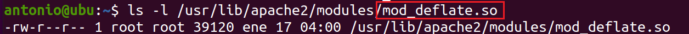

# Módulos.


El Servidor HTTP Apache es un programa modular en el que el administrador puede elegir la funcionalidad a incluir en el servidor seleccionando un conjunto de `módulos`. 

Los módulos se compilarán como ***Objetos Compartidos Dinámicos (DSOs)*** que existen por separado del archivo binario principal httpd. Los módulos DSO pueden compilarse en el momento en que se construye el servidor, o pueden compilarse y agregarse más tarde usando la Herramienta de Extensión Apache (apxs). Alternativamente, los módulos pueden compilarse estáticamente en el binario httpd cuando se construye el servidor.


El soporte DSO para cargar módulos individuales de Apache httpd se basa en un módulo llamado `MOD_SO`, que debe compilarse estáticamente en el núcleo de Apache. Es el único módulo además de `CORE` que no puede ponerse en un DSO en sí mismo. Prácticamente todos los otros módulos distribuidos de Apache son DSOs. 

Después de que un módulo se compile en un DSO llamado `mod_foo.so`, podemos usar la directiva `LOADMODULE` en el archivo `httpd.conf` o `apache.conf` para cargar este módulo al inicio o reinicio del servidor.

En Linux existe un mecanismo llamado ***enlace/carga dinámica de Objetos Compartidos Dinámicos (DSO)***, que proporciona una forma de construir un fragmento de código de programa en un formato especial para ***cargarlo en tiempo de ejecución*** en el espacio de direcciones de un programa ejecutable.

Esta carga generalmente se puede realizar de dos maneras: automáticamente por un programa del sistema llamado ```ld.so``` cuando se inicia un programa ejecutable, o manualmente desde dentro del programa en ejecución a través de una interfaz de sistema mediante las llamadas al sistema `dlopen()` / `dlsym()`.

En la primera forma, los DSO suelen llamarse ***bibliotecas compartidas*** o ***bibliotecas DSO*** y residen en un directorio del sistema (generalmente `/usr/lib`). Se codifica las referencias de la biblioteca en el archivo del programa ejecutable de Apache para que, en el momento de inicio, el cargador de Linux pueda colocar el DSO en ***/usr/lib***.

El programa ejecutable no necesita hacer nada por sí mismo para usar los símbolos del DSO porque la resolución completa la realiza el cargador de Linux. 

En la segunda forma, los DSO suelen llamarse ***objetos compartidos*** o ***archivos DSO*** y pueden tener un nombre con una extensión arbitraria (aunque generalmente la extensión es `.so`). Estos archivos suelen permanecer dentro de un directorio específico y no hay un enlace establecido automáticamente con el programa ejecutable donde se usan. 

En su lugar, el programa ejecutable carga manualmente el DSO en ***tiempo de ejecución*** en su espacio de direcciones a través de ***dlopen()***. 

El enfoque de biblioteca compartida es el típico, porque es para lo que se diseñó el mecanismo de DSO, por lo tanto, se utiliza para casi todos los tipos de bibliotecas que proporciona el sistema operativo.

Las características basadas en DSO mencionadas anteriormente tienen las siguientes ventajas:

- La gestión de Apache es más flexible en tiempo de ejecución porque el proceso del servidor puede ser ensamblado en tiempo de ejecución a través de directivas de configuración `LOADMODULE` en lugar de opciones de configuración en tiempo de compilación. 

- Apache puede ser fácilmente extendido con módulos de terceros incluso después de la instalación. 

## ¿Cómo cargamos los módulos?

Como hemos visto, Los DSO (Objetos Compartidos Dinámicos) son archivos que contienen código compilado que se puede cargar dinámicamente en un programa en tiempo de ejecución. En el contexto de Apache, los DSO se refieren a los módulos que ***extienden la funcionalidad del servidor web de Apache***. Estos módulos pueden proporcionar diversas características, como soporte para diferentes protocolos, seguridad adicional, capacidades de procesamiento de contenido dinámico, entre otros.

Los módulos de Apache son componentes de software que pueden ser agregados o eliminados para personalizar y extender las capacidades del servidor web Apache según nuestras necesidades. 

Supongamos que queremos habilitar el módulo de compresión de salida en Apache. Este módulo, llamado `mod_deflate`, comprime la respuesta HTTP antes de enviarla al cliente, lo que puede mejorar significativamente el rendimiento del sitio web. Para configurar este módulo como un DSO en Apache, seguiremos estos pasos:

Primero debemos comprobar que el módulo `mod_deflate` esté disponible en nuestra instalación de Apache. Por lo general, los módulos precompilados se encuentran en un directorio como `/usr/lib/apache2/modules/`.



Posteriormente, en el archivo de configuración principal de Apache, generalmente `httpd.conf` o `apache.conf`, añadimos la línea `LoadModule deflate_module modules/mod_deflate.so`, que carga el módulo `mod_deflate` como un DSO en el servidor Apache.

```apache
# Cargar el módulo mod_deflate
LoadModule deflate_module modules/mod_deflate.so

# Configuración del módulo mod_deflate
<IfModule mod_deflate.c>
    # Habilita la compresión de salida
    SetOutputFilter DEFLATE

    # Configura los tipos MIME que se van a comprimir
    AddOutputFilterByType DEFLATE text/html text/plain text/xml text/css text/javascript application/javascript application/json

    # Opcional: Configura los niveles de compresión
    DeflateCompressionLevel 9
</IfModule>
```


Después de agregar esta línea, guarda y cierra el archivo de configuración y reinicia el servidor Apache para que los cambios surtan efecto. Esto se puede hacer mediante el comando `sudo systemctl restart apache2` en sistemas Linux.

2. **Configuración de un módulo de Apache en el archivo de configuración:**

   Supongamos que queremos habilitar el módulo de redirección en Apache. Este módulo, llamado `mod_rewrite`, permite configurar redirecciones de URL de manera flexible y poderosa. Para configurar este módulo en el archivo de configuración de Apache, haríamos lo siguiente:

   - En el archivo de configuración de Apache, ubicado típicamente en `httpd.conf` o en archivos de configuración adicionales en el directorio `/etc/apache2/sites-available/`, añade una sección de configuración para el módulo `mod_rewrite`.
   - Dentro de esta sección, puedes especificar reglas de redirección utilizando la directiva `RewriteRule` y otras directivas proporcionadas por el módulo `mod_rewrite`.
   - Después de definir las reglas de redirección, guarda y cierra el archivo de configuración y reinicia el servidor Apache para que los cambios surtan efecto. Esto se puede hacer de la misma manera que se reinició el servidor en el ejemplo anterior.

Estos son solo ejemplos básicos de configuración de módulos DSO y módulos de Apache en un servidor Apache HTTP. La configuración específica puede variar dependiendo de las necesidades y el entorno del servidor.


[Vamos al siguiente contenido](./20-D.md)