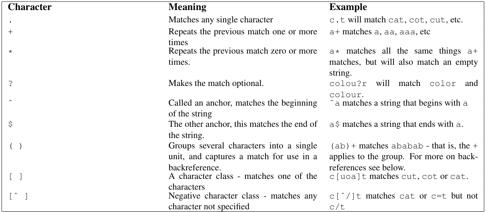

# Módulo de reescritura (mod_rewrite) en Apache.


`mod_rewrite` proporciona una forma de modificar dinámicamente las solicitudes de URL entrantes, basándose en reglas de expresiones regulares. Esto te permite mapear URLs arbitrarias en la estructura de URL interna de la manera que deseemoss. 

Soporta un número ilimitado de reglas y un número ilimitado de condiciones de regla adjuntas para cada regla, proporcionando un mecanismo de manipulación de URL realmente flexible y potente. Las manipulaciones de URL pueden depender de diversas pruebas: ***variables de servidor***, ***variables de entorno***, ***encabezados HTTP***, ***marcas de tiempo***, etc.

Las reglas de reescritura pueden operar en las URL completas, incluyendo las partes de la información de la ruta y de la cadena de consulta, y pueden ser utilizadas en el contexto de un servidor (`httpd.conf` o `apache.conf`), contexto de un ***virtualhost*** (bloques `<VIRTUALHOST>`), o contexto de un directorio (archivos `.htaccess` y bloques `<DIRECTORY>`). 

El resultado de la reescritura puede llevar a más reglas, sub-procesamiento interno, redireccionamiento de solicitud externa o paso de proxy.

Dado que `mod_rewrite` es muy poderoso, puede llegar a ser bastante complejo. Este apartado complementa la documentación aportara previamente sobre este módulo y trata de disminuir esa complejidad, proporcionando ejemplos altamente anotados de escenarios comunes que podemos gestionar con `mod_rewrite`. 

Recordemos que muchas tareas comunes de manipulación de URL no requieren la plena potencia y complejidad de `mod_rewrite`. Para tareas simples, podemos usar `mod_alias` 

El módulo `mod_alias` es otro componente importante de Apache. A diferencia de `mod_rewrite`, que se utiliza principalmente para la reescritura avanzada de URL, `mod_alias` se centra en la creación de alias y redirecciones simples de URL:

- ***Alias de directorios***: `mod_alias` permite asignar rutas de URL a directorios físicos en el sistema de archivos del servidor. Esto es útil cuando deseamos proporcionar acceso a ciertas ubicaciones del sistema de archivos utilizando rutas de URL más amigables o lógicas.

   Por ejemplo, podemos configurar un alias para que `http://tusitio.com/documentos` apunte a `/var/www/documentos` en el sistema de archivos del servidor. Esto significa que cuando alguien visite `http://tusitio.com/documentos`, el servidor entregará el contenido ubicado en `/var/www/documentos`.

- ***Redirecciones simples***: Además de los alias, `mod_alias` también puede manejar redirecciones simples de URL. Esto implica dirigir una URL a otra, ya sea dentro del mismo servidor o a otro sitio web.

   Por ejemplo, podemos configurar una redirección para que `http://tusitio.com/blog` redirija automáticamente a `http://blog.tusitio.com`, lo que puede ser útil si tienes tu blog alojado en un subdominio separado.

`mod_alias` es útil para manejar casos simples de asignación de URL a recursos del servidor, como directorios específicos o redirecciones básicas. Es más fácil de configurar y entender que `mod_rewrite`, lo que lo hace ideal para tareas que no requieren la complejidad de reescritura de URL que proporciona `mod_rewrite`. Sin embargo, para casos más avanzados de manipulación de URL, `mod_rewrite` sigue siendo la opción preferida.

## ACTIVIDAD PRÁCTICA.

Redirección de URL sencilla con `mod_alias`.

Objetivo: Usar `mod_alias` para realizar una redirección simple.

Instrucciones:

1. Preparación del la resolución DNS:
  
   Abre el archivo `/etc/hosts` en un editor de texto desde la terminal:

   ```bash
   sudo nano /etc/hosts
   ```
   Agrega las siguientes líneas al final del archivo:

   ```plaintext
   127.0.0.1    tusitio.com
   127.0.0.1    blog.tusitio.com
   ```
   Guarda los cambios y cierra el editor.

2. Configuración de Apache:
   Abre el archivo de configuración de Apache (`apache2.conf` o `httpd.conf`) en un editor de texto desde la terminal:
   ```bash
   sudo nano /etc/apache2/apache2.conf  # en Ubuntu
   ```
   
   Dentro de la sección correspondiente al sitio virtual (`<VirtualHost>`), agrega las siguientes directivas:
   ```apache
   <VirtualHost *:80>
      ServerName tusitio.com
      DocumentRoot /var/www/html
      
      # Alias para el directorio de documentos
      Alias /documentos /var/www/documentos
      
      # Redirección para el blog
      Redirect /blog http://blog.tusitio.com
      
      # Otros ajustes de configuración
   </VirtualHost>
   ```
   Guarda los cambios y cierra el editor.

3. Reiniciar Apache:
   
   Reinicia Apache para aplicar los cambios en la configuración:

   ```bash
   sudo systemctl restart apache2
   ```

4. Prueba:
   Abre un navegador web en tu sistema y visita `http://tusitio.com/documentos` en la barra de direcciones. Deberías ver el contenido del directorio `/var/www/documentos`.
   
   A continuación, visita `http://tusitio.com/blog`. Deberías ser redirigido automáticamente a `http://blog.tusitio.com`.


## Expresiones regulares.

`mod_rewrite` utiliza el vocabulario de ***Expresiones Regulares Compatibles con Perl***. Los siguientes son los bloques de construcción mínimos que necesitarás para escribir expresiones regulares y REWRITERULEs. Ciertamente, no representan un vocabulario completo de expresiones regulares, pero son un buen punto de partida y deberían ayudarte a leer expresiones regulares básicas, así como a escribir las tuyas propias.




[Vamos al siguiente contenido](./20-H.md)