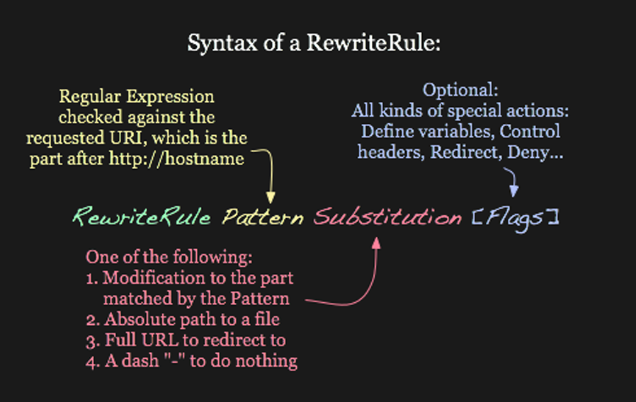
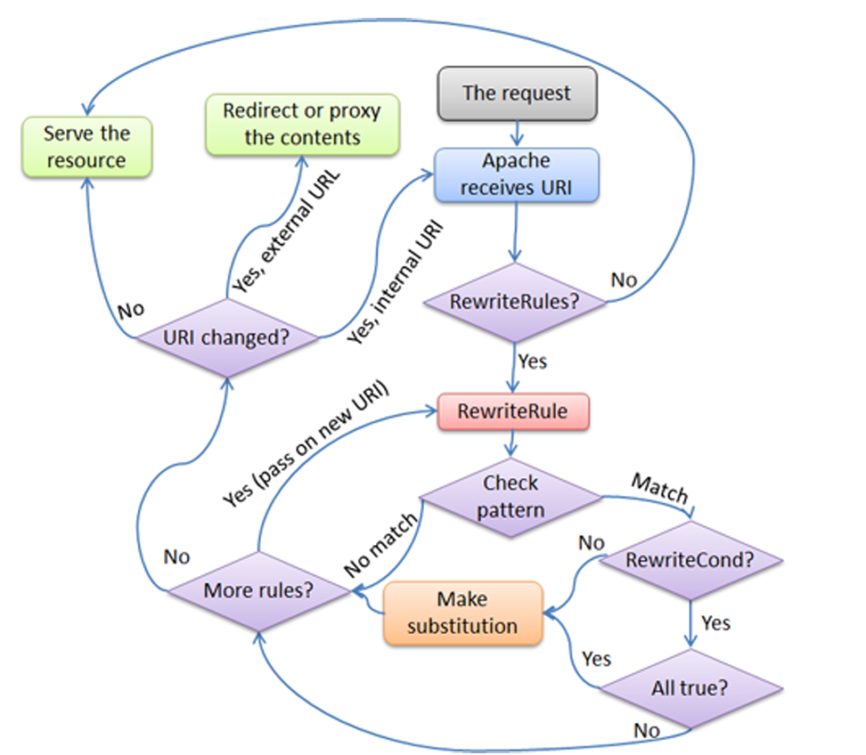

# Módulo de reescritura (mod_rewrite) en Apache.

## `mod_alias` y `mod_rewrite`

**`mod_alias`** y **`mod_rewrite`** son módulos de Apache que ya hemos mencionado anteriormente. Se utilizan para **redirigir o reescribir URLs**, pero lo hacen de formas diferentes y con distintos niveles de complejidad.

---

## `mod_alias`

`mod_alias` es el módulo de Apache (el más sencillo de los dos) que permite definir:

1. **Redirecciones** (por ejemplo, cuando una URL ha cambiado de ubicación).
2. **Alias** (cuando una URL apunta a una carpeta distinta a la del documento raíz).

### Ejemplo básico de `mod_alias`:

```apache
Redirect 301 /viejo-recurso /nuevo-recurso
```

Esto redirige permanentemente a los usuarios de `/viejo-recurso` a `/nuevo-recurso`.

También permite crear alias de carpetas:

```apache
Alias /app/ /var/www/mi-aplicacion/
```

Esto hace que acceder a `http://localhost/app/archivo.html` sirva el archivo ubicado físicamente en `/var/www/mi-aplicacion/archivo.html`.

`mod_alias` es **rápido y directo**, pero limitado: no permite condiciones, ni expresiones regulares complejas.

---

## `mod_rewrite` (Introducción)

`mod_rewrite` es un módulo **más avanzado** y flexible. Permite principalmente:

* Reescribir URLs de forma interna o externa.
* Usar expresiones regulares.
* Aplicar condiciones (`RewriteCond`) basadas en el agente de usuario, IP, protocolo, etc.
* Crear URLs "amigables" para buscadores o aplicaciones.

### Ejemplo básico de `mod_rewrite`:

```apache
RewriteEngine On
RewriteRule ^producto/([0-9]+)$ producto.php?id=$1 [L]
```

Esto hace que una URL como `/producto/25` se reescriba internamente como `producto.php?id=25`.

---

## Relación entre `mod_alias` y `mod_rewrite`

Ambos se usan para manipular URLs, pero **a distintos niveles**:

* `mod_alias` actúa **de forma simple**: no usa expresiones regulares, no aplica condiciones, y es más fácil de configurar.
* `mod_rewrite` actúa **de forma más avanzada** (y por tanto su compresión requiere más esfuerzo): permite transformaciones condicionales, patrones avanzados y lógicas más detalladas.

Ambos pueden coexistir en el mismo servidor. Sin embargo, hay un detalle importante en su relación:

### Orden de ejecución

Apache procesa primero `mod_rewrite`, luego `mod_alias` **solo si se usa la bandera `[PT]` (Pass Through)** (que veremos en breve) en una regla de `mod_rewrite`.
Esto significa que si escribes una regla en `mod_rewrite` que reescribe una URL a una ruta que coincide con un `Alias`, **debes usar `[PT]`** para que `mod_alias` la entienda.

### Ejemplo de interacción:

```apache
Alias /static/ /var/www/estatico/

RewriteEngine On
RewriteRule ^archivos/(.*)$ /static/$1 [PT,L]
```

Aquí, `mod_rewrite` transforma `/archivos/logo.png` en `/static/logo.png`,
y gracias a `[PT]`, Apache permite que `mod_alias` sirva `/var/www/estatico/logo.png`.

---

## En resumen

| Característica           | `mod_alias`     | `mod_rewrite`                |
| ------------------------ | --------------- | ---------------------------- |
| Complejidad              | Baja            | Alta                         |
| Expresiones regulares    | No              | Sí                           |
| Condiciones              | No              | Sí (`RewriteCond`)           |
| Redirección externa      | Sí (`Redirect`) | Sí (`RewriteRule` con `[R]`) |
| Reescritura interna      | Sí (`Alias`)    | Sí                           |
| Requiere `RewriteEngine` | No              | Sí                           |


### ¿Cuál usar?

| Necesidad                             | Usa           |
| ------------------------------------- | ------------- |
| Redirección básica                    | `mod_alias`   |
| Reescritura o redirección condicional | `mod_rewrite` |


## `mod_rewrite`

Volviendo a `mod_rewrite`, este proporciona una forma de modificar dinámicamente las solicitudes de URL entrantes, basándose en reglas de expresiones regulares. Esto te permite mapear URLs arbitrarias en la estructura de URL interna de la manera que deseemoss. 

Soporta un número ilimitado de reglas y un número ilimitado de condiciones de regla adjuntas para cada regla, proporcionando un mecanismo de manipulación de URL realmente flexible y potente. Las manipulaciones de URL pueden depender de diversas pruebas: ***variables de servidor***, ***variables de entorno***, ***encabezados HTTP***, ***marcas de tiempo***, etc.

Las reglas de reescritura pueden operar en las URL completas, incluyendo las partes de la información de la ruta y de la cadena de consulta, y pueden ser utilizadas en el contexto de un servidor (`httpd.conf` o `apache.conf`), contexto de un ***virtualhost*** (bloques `<VIRTUALHOST>`), o contexto de un directorio (archivos `.htaccess` y bloques `<DIRECTORY>`). 

El resultado de la reescritura puede llevar a más reglas, sub-procesamiento interno, redireccionamiento de solicitud externa o paso de proxy.

Dado que `mod_rewrite` es muy poderoso, puede llegar a ser bastante complejo. En este apartado desmenuzamos esa complejidad, proporcionando ejemplos altamente anotados de escenarios comunes que podemos gestionar con `mod_rewrite`. 


### `mod_rewrite` y `mod_alias`, cuando usar uno u otro

Recordemos que muchas tareas comunes de manipulación de URL no requieren la plena potencia y complejidad de `mod_rewrite`. Para tareas simples, podemos usar `mod_alias` 

### Qué hace `mod_alias`

El módulo `mod_alias`, a diferencia de `mod_rewrite` (que se utiliza principalmente para la reescritura avanzada de URL), se centra en la creación de alias y redirecciones simples de URL:

- ***Alias de directorios***: `mod_alias` permite asignar rutas de URL a directorios físicos en el sistema de archivos del servidor. Esto es útil cuando deseamos proporcionar acceso a ciertas ubicaciones del sistema de archivos utilizando rutas de URL más amigables o lógicas.

   Por ejemplo, podemos configurar un alias para que `http://tusitio.com/documentos` apunte a `/var/www/documentos` en el sistema de archivos del servidor. Esto significa que cuando alguien visite `http://tusitio.com/documentos`, el servidor entregará el contenido ubicado en `/var/www/documentos`.

- ***Redirecciones simples***: Además de los alias, `mod_alias` también puede manejar redirecciones simples de URL. Esto implica dirigir una URL a otra, ya sea dentro del mismo servidor o a otro sitio web.

   Por ejemplo, podemos configurar una redirección para que `http://tusitio.com/blog` redirija automáticamente a `http://blog.tusitio.com`, lo que puede ser útil si tienes tu blog alojado en un subdominio separado.

`mod_alias` es útil para manejar casos simples de asignación de URL a recursos del servidor, como directorios específicos o redirecciones básicas. Es más fácil de configurar y entender que `mod_rewrite`, lo que lo hace ideal para tareas que no requieren la complejidad de reescritura de URL que proporciona `mod_rewrite`. Sin embargo, para casos más avanzados de manipulación de URL, `mod_rewrite` sigue siendo la opción preferida.


⸻

### Ejemplos con `mod_alias`


Redirecciones 30X con Redirect 

Puedes hacer redirecciones con diferentes códigos HTTP:

#### 1. Redirección 301 (permanente):

```apache
Redirect 301 /viejo-articulo https://www.ejemplo.com/nuevo-articulo
```

	•	Si el usuario visita tusitio.com/viejo-articulo, lo manda permanentemente a la nueva URL.
	•	Muy útil para SEO cuando mueves contenido.

⸻

#### 2. Redirección 302 (temporal):

```apache
Redirect 302 /promo https://www.ejemplo.com/oferta-actual
```


	•	Ideal si es una promoción o algo temporal.

⸻

#### 3. Redirección sin especificar código (por defecto 302):

```apache
Redirect /antigua https://www.ejemplo.com/nueva
```

	•	Esto es equivalente a Redirect 302.

⸻

#### 4. RedirectMatch con expresiones regulares:

```apache
RedirectMatch 301 ^/producto/([0-9]+)$ https://www.ejemplo.com/catalogo?id=$1
```

	•	Redirección 301 para URLs como /producto/123 hacia /catalogo?id=123.

⸻


Ejemplo real con .htaccess:  

```
Redirect 301 /contacto-antiguo /contacto
Redirect 302 /black-friday /ofertas. 
```

⸻

## ACTIVIDAD PRÁCTICA.

Redirección de URL sencilla con `mod_alias`.

Objetivo: Usar `mod_alias` para realizar una redirección simple.

Instrucciones:

1. ***Preparación del la resolución DNS***:
  
   Abre el archivo `/etc/hosts` en un editor de texto desde la terminal:

   ```bash
   sudo nano /etc/hosts
   ```
   
   Agrega las siguientes líneas al final del archivo:

   ```plaintext
   127.0.0.1    tusitio.com
   127.0.0.1    blog.tusitio.com
   ```
   Guarda los cambios y cierra el editor.

2. ***Configuración de Apache***:
   Abre el archivo de configuración de Apache (`apache2.conf` o `httpd.conf`) en un editor de texto desde la terminal:
   ```bash
   sudo nano /etc/apache2/apache2.conf  # en Ubuntu
   ```
   
   Dentro de la sección correspondiente al sitio virtual (`<VirtualHost>`), agrega las siguientes directivas:
   ```apache
   <VirtualHost *:80>
      ServerName tusitio.com
      DocumentRoot /var/www/html
      
      # Alias para el directorio de documentos
      Alias /documentos /var/www/documentos
      
      # Redirección para el blog
      Redirect /blog http://blog.tusitio.com
      
      # Otros ajustes de configuración
   </VirtualHost>
   ```
   Guarda los cambios y cierra el editor.

3. ***Reiniciar Apache***:
   
   Reinicia Apache para aplicar los cambios en la configuración:

   ```bash
   sudo systemctl restart apache2
   ```

4. ***Prueba***:

   Abre un navegador web en tu sistema y visita `http://tusitio.com/documentos` en la barra de direcciones. Deberías ver el contenido del directorio `/var/www/documentos`.
   
   A continuación, visita `http://tusitio.com/blog`. Deberías ser redirigido automáticamente a `http://blog.tusitio.com`.


---

## Ejemplos introductorios de `mod_rewrite`

### **1. Redirección 301 permanente**

Para SEO o cambios de estructura:

```apache
RewriteEngine On

# Redirige /antigua-pagina a /nueva-pagina
RewriteRule ^antigua-pagina$ /nueva-pagina [R=301,L]
```

---

### **2. URL amigables para un sitio tipo blog**

Convierte `/articulo/123/titulo-del-post` en `post.php?id=123`

```apache
RewriteEngine On

RewriteRule ^articulo/([0-9]+)/[a-zA-Z0-9-]+$ post.php?id=$1 [L]
```

---

### **3. Forzar HTTPS y sin "www"**

Redirección combinada para SEO y seguridad:

```apache
RewriteEngine On

# Forzar sin www
RewriteCond %{HTTP_HOST} ^www\.(.+)$ [NC]
RewriteRule ^ https://%1%{REQUEST_URI} [R=301,L]

# Forzar HTTPS
RewriteCond %{HTTPS} off
RewriteRule ^ https://%{HTTP_HOST}%{REQUEST_URI} [R=301,L]
```

---

Perfecto. Vamos a ver la diferencia entre **`RewriteRule`** y **`RewriteCond`** de forma clara y con ejemplos didácticos.

---

## **1. ¿Qué es `RewriteRule`?**

`RewriteRule` es la directiva principal de `mod_rewrite`.
Sirve para **reescribir URLs** basadas en un patrón.

### **Sintaxis básica:**

```apache
RewriteRule <patrón> <sustitución> [opciones]
```

* **`<patrón>`**: la parte de la URL que se quiere interceptar.
* **`<sustitución>`**: a qué se debe transformar esa URL (puede ser interna o una redirección).
* **`[opciones]`**: banderas como `[L]`, `[R=301]`, `[QSA]`, etc.

### **Ejemplo:**

```apache
RewriteRule ^producto/([0-9]+)$ producto.php?id=$1 [L]
```

* Reescribe `/producto/25` a `producto.php?id=25`.

---

## **2. ¿Qué es `RewriteCond`?**

`RewriteCond` se usa **junto a `RewriteRule`** para aplicar condiciones.
Es decir: *“solo aplicar esta regla si se cumple cierta condición”*.

### **Sintaxis básica:**

```apache
RewriteCond <variable> <condición> [opciones]
```

* La condición puede depender de cosas como:

  * El user-agent
  * La IP del visitante
  * Si la conexión es HTTP o HTTPS
  * Si un archivo existe o no

---

## **Ejemplo combinado:**

```apache
RewriteCond %{HTTPS} off
RewriteRule ^admin /login.php [R=301,L]
```

* Solo si **la conexión NO es HTTPS**, redirige `/admin` a `/login.php`.

---

## **¿Qué variables se pueden usar en `RewriteCond`?**

Algunos ejemplos:

| Variable             | Significado                              |
| -------------------- | ---------------------------------------- |
| `%{HTTP_HOST}`       | El dominio solicitado                    |
| `%{REQUEST_URI}`     | La ruta solicitada                       |
| `%{REMOTE_ADDR}`     | IP del visitante                         |
| `%{HTTP_USER_AGENT}` | Navegador del visitante                  |
| `%{HTTPS}`           | Indica si la conexión es segura (on/off) |

---

### **Ejemplo: redirigir solo a visitantes de cierta IP**

```apache
RewriteCond %{REMOTE_ADDR} ^123\.45\.67\.89$
RewriteRule ^admin/.*$ /denegado.html [L]
```

Solo esa IP puede acceder a `/admin/`. Los demás verán `/denegado.html`.

---

### **Resumen:**

| **Elemento**  | **Sirve para...**                       | **Funciona solo o necesita el otro** |
| ------------- | --------------------------------------- | ------------------------------------ |
| `RewriteRule` | Reescribir o redirigir una URL          | Puede funcionar solo                 |
| `RewriteCond` | Aplicar condiciones a una `RewriteRule` | **Necesita una `RewriteRule`**       |

---


## Expresiones regulares en `mod_rewrite`

`mod_rewrite` utiliza el vocabulario de ***Expresiones Regulares Compatibles con Perl***. Los siguientes son los bloques de construcción mínimos que necesitarás para escribir expresiones regulares y REWRITERULEs. 

Ciertamente, no representan un vocabulario completo de expresiones regulares, pero son un buen punto de partida y deberían ayudarte a leer expresiones regulares básicas, así como a escribir las tuyas propias.

Claro. Aquí tienes la tabla convertida a texto y traducida al español:

---

### Tabla de caracteres especiales en expresiones regulares

| **Carácter** | **Significado**                                                                     | **Ejemplo**                                                            |
| ------------ | ----------------------------------------------------------------------------------- | ---------------------------------------------------------------------- |
| `.`          | Coincide con cualquier carácter individual                                          | `c.t` coincidirá con `cat`, `cot`, `cut`, etc.                         |
| `+`          | Repite la coincidencia anterior una o más veces                                     | `a+` coincide con `a`, `aa`, `aaa`, etc.                               |
| `*`          | Repite la coincidencia anterior cero o más veces                                    | `a*` coincide con lo mismo que `a+`, pero también con una cadena vacía |
| `?`          | Hace que la coincidencia anterior sea opcional                                      | `colou?r` coincide con `color` y `colour`                              |
| `^`          | Llamado “ancla”, coincide con el **inicio** de la cadena                            | `^a` coincide con una cadena que empieza por `a`                       |
| `$`          | Otra “ancla”, coincide con el **final** de la cadena                                | `a$` coincide con una cadena que termina en `a`                        |
| `( )`        | Agrupa varios caracteres en una unidad y captura la coincidencia para referenciarla | `(ab)+` coincide con `ababab` — el `+` aplica al grupo.                |
| `[ ]`        | Clase de caracteres — coincide con **uno** de los caracteres especificados          | `c[uoa]t` coincide con `cut`, `cot` o `cat`                            |
| `[^ ]`       | Clase negativa — coincide con cualquier carácter **excepto** los indicados          | `c[^/]t` coincide con `cat` o `c=t` pero **no** con `c/t`              |


## RewriteRule.

Una `RewriteRule` está formada por tres argumentos separados por espacios. Estos son:

1. ***Patrón***: qué URLs entrantes deben ser afectadas por la regla;
2. ***Sustitución***: hacia dónde deben dirigirse las solicitudes que coincidan;
3. ***[flags]***: opciones que afectan la solicitud reescrita.

El ***Patrón*** es una expresión regular. Inicialmente (para la primera regla de reescritura o hasta que ocurra una sustitución), se compara con la URL-path de la solicitud entrante (la parte después del nombre del host pero antes de cualquier signo de interrogación que indique el inicio de una cadena de consulta) o, en el contexto de un directorio, con la ruta de la solicitud relativa al directorio para el cual se define la regla. 

Una vez que ha ocurrido una ***sustitución***, las reglas que siguen se comparan con el valor sustituido.



La ***sustitución*** puede ser una de tres:

1. Una ruta completa del sistema de archivos a un recurso:
   ```apache
   RewriteRule ^/juegos /usr/local/juegos/web
   ```
   Esto mapea una solicitud a una ubicación arbitraria en nuestro sistema de archivos, similar a la directiva `ALIAS`.

2. Una ruta web a un recurso:
   ```apache
   RewriteRule ^/foo$ /bar
   ```
   Si DOCUMENTROOT está configurado como `/usr/local/apache2/htdocs`, entonces esta directiva mapearía las solicitudes para `http://ejemplo.com/foo` a la ruta `/usr/local/apache2/htdocs/bar`.

3. Una URL absoluta:
   ```apache
   RewriteRule ^/producto/ver$ http://sitio2.ejemplo.com/verproducto.html [R]
   ```
   Esto indica al cliente que haga una nueva solicitud para la URL especificada.

La ***sustitución*** también puede contener referencias posteriores a partes de la URL-path entrante que coinciden con el ***patrón***. Considera lo siguiente:

```apache
RewriteRule ^/producto/(.*)/ver$ /var/web/productdb/$1
```

La variable `$1` será reemplazada con cualquier texto que coincida con la expresión dentro de los paréntesis en el patrón. Por ejemplo, una solicitud para `http://ejemplo.com/producto/r14df/ver` se mapeará a la ruta `/var/web/productdb/r14df`.

Si hay más de una expresión entre paréntesis, están disponibles en orden en las variables `$1`, `$2`, `$3`, y así sucesivamente.

## Las Banderas de Reescritura

El comportamiento de una ***RewriteRule*** puede modificarse mediante la aplicación de una o más banderas (flags) al final de la regla. Por ejemplo, el comportamiento de coincidencia de una regla puede hacerse insensible a mayúsculas y minúsculas mediante la aplicación de la bandera `[NC]`:

```apache
RewriteRule ^cachorro.html perropequeño.html [NC]
```

- `B(escape backreferences)`: La bandera [B] instruye a RewriteRule a escapar los caracteres no alfanuméricos antes de aplicar la transformación. `mod_rewrite` debe desescapar las URL antes de mapearlas, por lo que las referencias posteriores se desescapan en el momento en que se aplican. Usando la bandera `B`, los caracteres no alfanuméricos en las referencias posteriores serán escapados. Por ejemplo, considera la regla:

   ```apache
   RewriteRule ^buscar/(.*)$ /buscar.php?termino=$1 [B]
   ```
   Dado un término de búsqueda `x & y/z`, un navegador lo codificará como `x%20%26%20y%2Fz`, haciendo la solicitud `buscar/x%20%26%20y%2Fz`. Sin la bandera `B`, esta regla de reescritura mapeará a `buscar.php?termino=x & y/z`, que no es una URL válida, y por lo tanto se codificará como `buscar.php?termino=x%20&y%2Fz=`, lo cual no es lo que se pretendía. Con la bandera `B` establecida en esta misma regla, los parámetros son re-codificados antes de ser pasados a la URL de salida, resultando en un mapeo correcto a `/buscar.php?termino=x%20%26%20y%2Fz`.

- `C—encadenar`: La bandera [C] o [chain] indica que la RewriteRule está encadenada a la siguiente regla. Es decir, si la regla coincide, entonces se procesa como de costumbre y el control pasa a la siguiente regla. Sin embargo, si no coincide, entonces se omiten la siguiente regla y cualquier otra regla que esté encadenada con ella.

   Por ejemplo, considera el siguiente conjunto de reglas:

   ```apache
   RewriteEngine On

   # Primera regla
   RewriteRule ^products/(.*)$ /catalog.php?product=$1 [C]

   # Segunda regla, encadenada
   RewriteRule ^catalog.php$ /shop.php [L]
   ```

   En este ejemplo, si una solicitud coincide con la primera regla y la URI comienza con `/products/`, se procesará como de costumbre y luego pasará a la siguiente regla. Sin embargo, si no coincide con la primera regla, se omitirá la segunda regla y cualquier otra regla que esté encadenada después de ella.

- `CO—cookie`: La bandera [CO], o [cookie], permite establecer una cookie cuando una determinada RewriteRule coincide. El argumento consiste en tres campos requeridos y cuatro campos opcionales.
   
   La sintaxis completa para la bandera, incluyendo todos los atributos, es la siguiente:
   ```plaintext
   [CO=NOMBRE:VALOR:DOMINIO:tiempo_de_vida:ruta:seguro:httponly]
   ```
   
   - ***Dominio***: El dominio para el cual deseamos que la cookie sea válida. Esto puede ser un nombre de host, como `www.ejemplo.com`, o puede ser un dominio, como `.ejemplo.com`. 

   Además, opcionalmente podemos configurar los siguientes valores:
      - ***Tiempo de vida***: El tiempo durante el cual persistirá la cookie, en minutos. Un valor de 0 indica que la cookie persistirá solo durante la sesión actual del navegador. Este es el valor predeterminado si no se especifica ninguno.
      - ***Ruta***: La ruta, en el sitio web actual, para la cual la cookie es válida, como `/clientes/` o `/archivos/descargar/`. De forma predeterminada, esto se establece en `/`, es decir, el sitio web completo.
      - ***Seguro***: Si se establece en `secure`, `true` o `1`, la cookie solo se permitirá a través de conexiones seguras (https).
      - ***Httponly***: Si se establece en `HttpOnly`, `true` o `1`, la cookie tendrá la bandera `HttpOnly`, lo que significa que la cookie es inaccesible para el código JavaScript en navegadores que admiten esta función.
      
   
   Aquí tenemos un ejemplo:
   ```apache
   RewriteEngine On
   RewriteRule ^/index\.html - [CO=frontdoor:yes:.ejemplo.com:1440:/]
   ```
   La regla no reescribe la solicitud. El destino de reescritura `-` le indica a `mod_rewrite` que pase la solicitud sin cambios. En su lugar, establece una cookie llamada `frontdoor` con un valor de `yes`. La cookie es válida para cualquier host en el dominio `.ejemplo.com`. Se establece para expirar en `1440 minutos` (24 horas) y se devuelve para todas las URIs.

- `E—env`: Con la bandera [E], o [env], podemos establecer el valor de una variable de entorno. La sintaxis completa para esta bandera es:
   ```plaintext
   [E=VAR:VAL] [E=!VAR]
   ```

   ```plaintext
   [E=VAR]
   ```
   
   puedes establecer la variable de entorno llamada VAR con un valor vacío.
   
   
   ```plaintext
   [E=!VAR]
   ```
   
   permite anular una variable de entorno previamente establecida llamada VAR.

   Las variables de entorno pueden ser utilizadas en una variedad de contextos, como las directivas `RewriteRule` o directivas `CustomLog`.

   El siguiente ejemplo establece una variable de entorno llamada `image` con un valor de `1` si la URI solicitada es un archivo de imagen. A continuación, esa variable de entorno se utiliza para excluir esas solicitudes del registro de acceso.

   ```apache
   RewriteRule \.(png|gif|jpg)$ - [E=image:1]
   CustomLog logs/access_log combined env=!image
   ```

- `F—forbiden`: El uso de la bandera [F] hace que el servidor devuelva un código de estado `403 Prohibido` al cliente. 

   La siguiente regla prohibirá que se descarguen archivos `.exe` desde el servidor.

   ```apache
   RewriteRule \.exe - [F]
   ```
   Este ejemplo utiliza la sintaxis `-` para el objetivo de reescritura, lo que significa que la URI solicitada no se modifica. No hay razón para reescribir a otra URI si vamos a prohibir la solicitud.

   Cuando se usa `[F]`, se implica un `[L]`, es decir, la respuesta se devuelve inmediatamente y no se evalúan más reglas.

   `L—Last`: La bandera [L] hace que `mod_rewrite`deje de procesar el conjunto de reglas. En la mayoría de los contextos, esto significa que si la regla coincide, no se procesarán más reglas. (sería como un comando `break` en C). Usa esta bandera para indicar que la regla actual debe aplicarse de inmediato sin considerar más reglas.

   Si estamoss usando `RewriteRule` en archivos `.htaccess` o en secciones `<DIRECTORY>`, es importante entender cómo se procesan las reglas. La forma simplificada de esto es que una vez que las reglas han sido procesadas, la solicitud reescrita se devuelve al motor de análisis de URL para que haga lo que sea necesario con ella. Es posible que mientras se maneja la solicitud reescrita, se encuentre nuevamente el archivo `.htaccess` o la sección `<DIRECTORY>`, y por lo tanto, el conjunto de reglas se ejecute nuevamente desde el principio. Esto sucederá  si una de las reglas causa una redirección, ya sea interna o externa, lo que hace que el proceso de solicitud se reinicie.

   Por lo tanto, es importante, si estmoss usando directivas `RewriteRule` en uno de estos contextos, tomar medidas explícitas para evitar bucles de reglas, y no confiar únicamente en la bandera `[L]` para terminar la ejecución de una serie de reglas, como se muestra a continuación.

   Una bandera alternativa, `[END]`, puede usarse para terminar no solo la ronda actual de procesamiento de reescritura, sino también para evitar que ocurra cualquier procesamiento de reescritura posterior en el contexto de `.htaccess`. 

   El ejemplo dado aquí reescribirá cualquier solicitud a `index.php`, dando la solicitud original como un argumento de cadena de consulta a `index.php`, sin embargo, `RewriteCond` asegura que si la solicitud ya es para `index.php`, la `RewriteRule` se omitirá.

   ```apache
   RewriteBase /
   RewriteCond %{REQUEST_URI} != /index.php
   RewriteRule ˆ(.*) /index.php?req=$1 [L,PT]
   ```

- `NC—nocase`: El uso de la bandera `[NC]` hace que la `RewriteRule` se empareje de manera insensible a mayúsculas y minúsculas. Es decir, no importa si las letras aparecen en mayúsculas o minúsculas en la URI.

   En el ejemplo a continuación, cualquier solicitud de un archivo de imagen se enviará por proxy a su servidor de imágenes dedicado. La coincidencia no distingue entre mayúsculas y minúsculas, por lo que los archivos `.jpg` y `.JPG` son aceptados, por ejemplo.

   ```apache
   RewriteRule (.*\.(jpg|gif|png))$ http://images.example.com$1 [P,NC]
   ```

- `NE—noescape`: Por defecto, los caracteres especiales, como `&` y `?`, por ejemplo, se convertirán a su equivalente en código hexadecimal. El uso de la bandera `[NE]` evita que eso suceda.

   ```apache
   RewriteRule ^/anchor/(.+) /bigpage.html#$1 [NE,R]
   ```

   El ejemplo redirigirá `/anchor/xyz` a `/bigpage.html#xyz`. Omitir el `[NE]` resultará en que el `#` se convierta en su equivalente en código hexadecimal, `%23`, lo que provocará un error de `404 Not Found`.

- `P—proxy`: El uso de la bandera `[P]` hace que la solicitud sea manejada por `mod_proxy`, y se procesa a través de una solicitud de proxy. Por ejemplo, si deseamos que todas las solicitudes de imágenes sean manejadas por un servidor de imágenes en el backend, podriamos hacer algo como lo siguiente:

   ```apache
   RewriteRule /(.*)\.(jpg|gif|png)$ http://images.example.com/$1.$2 [P]
   ```

   El uso de la bandera `[P]` implica `[L]`, es decir, la solicitud se envía inmediatamente a través del proxy y no se considerarán ninguna de las reglas siguientes.

- `PT—passthrough`: El objetivo (o cadena de sustitución) en una `RewriteRule` se asume que es una ruta de archivo, de forma predeterminada. El uso de la bandera `[PT]` hace que se trate como un URI en su lugar. Es decir, el uso de la bandera `[PT]` hace que el resultado de la `RewriteRule` se pase nuevamente a través del mapeo de URL, de modo que los mapeos basados en la ubicación, como `ALIAS` o `REDIRECT`, por ejemplo, puedan tener la oportunidad de surtir efecto.

   Si, por ejemplo, tenemos un ALIAS para `/icons`, y una REWRITERULE que apunta allí, deberiamoss usar la bandera `[PT]` para asegurarnos de que se evalúe el ALIAS.

   ```apache
   Alias /icons /usr/local/apache/icons
   RewriteRule /pics/(.+)\.jpg$ /icons/$1.gif [PT]
   ```

   La omisión de la bandera `[PT]` en este caso hará que el ALIAS sea ignorado, lo que resultará en un error de `Archivo no encontrado`.

   La bandera `[PT]` implica la bandera `[L]`. 

- `R—redirect`: El uso de la bandera `[R]` provoca que se emita una redirección HTTP al navegador. Si se especifica una URL completamente calificada (es decir, incluyendo `http://nombre_servidor/`), entonces se emitirá una redirección a esa ubicación. De lo contrario, se utilizarán el protocolo actual, el nombre del servidor y el número de puerto para generar la URL enviada con la redirección.

   Se puede especificar cualquier código de estado de respuesta HTTP válido, utilizando la sintaxis `[R=305]`, siendo utilizado por defecto el código de estado `302` si no se especifica ninguno. El código de estado especificado no necesariamente tiene que ser un código de estado de redirección `3xx`. Sin embargo, si un código de estado está fuera del rango de redirección `300-399`, entonces la cadena de sustitución se elimina por completo y la reescritura se detiene como si se usara la `[L]`.

   Casi siempre se desearemos usar `[R]` en conjunto con `[L]`  (es decir, usar `[R,L]`) porque por sí solo, la bandera `[R]` antepone `http://estehost[:este_puerto]` a la URI, pero luego pasa esto a la siguiente regla en el conjunto de reglas, lo que a menudo puede resultar en advertencias de `URI no válida en la solicitud`.

## Resumen del procesamiento de mod_rewrite

En primer lugar, la URL se compara con el Patrón de cada regla. 

Si no coincide, `mod_rewrite` detiene inmediatamente el procesamiento de esta regla y continúa con la siguiente regla. Si el Patrón coincide, `mod_rewrite` busca condiciones de reglas correspondientes (directivas `RewriteCond`, que aparecen inmediatamente encima de RewriteRule en la configuración). 

Si no están presentes, ***sustituye la URL con un nuevo valor***, que se construye a partir de la cadena substitución, y continúa con su bucle de reglas. Pero si existen condiciones, comienza un bucle interno para procesarlas en el orden en que se enumeran. 

Para las condiciones, la lógica es diferente: no hacemos coincidir un patrón con la URL actual. En su lugar, primero creamos una cadena de texto expandiendo variables, y luego intentamos coincidir con ella. Si el patrón no coincide, el conjunto completo de condiciones y la regla correspondiente fallan. Si el patrón coincide, se procesa la siguiente condición hasta que no haya más condiciones disponibles. Si todas las condiciones coinciden, se continúa el procesamiento con la sustitución de la URL por la Substitución.



## ACTIVIDAD PRÁCTICA.

Repaso de `mod_rewrite` y sus banderas

Objetivo: Practicar el uso de `mod_rewrite` y comprender el funcionamiento de sus diferentes banderas.


Ejercicios:

Actividad Práctica: Repaso de mod_rewrite y sus banderas

Objetivo: Practicar el uso de mod_rewrite y comprender el funcionamiento de sus diferentes banderas.

Instrucciones:
1. Lee cuidadosamente cada enunciado y completa las tareas indicadas.
2. Utiliza las banderas adecuadas de `mod_rewrite` para lograr los resultados deseados.
3. Si tienes dudas, consulta la documentación que hemos aportado en este documento o realiza búsquedas adicionales.

Ejercicios:

1. Redireccionamiento Simple:
   a. Accede al archivo de configuración de Apache (`httpd.conf`, `apache.conf` o `.htaccess`, según tu configuración).
   b. Crea una regla de reescritura utilizando `RewriteRule` para redireccionar todas las solicitudes de `/blog` a `/articles`.
   c. Asegúrate de que la redirección sea permanente utilizando la bandera adecuada.
   d. Guarda los cambios y reinicia el servidor Apache para aplicar la configuración.
   e. Comprueba en tu navegador la redirección.

2. Redirección con Parámetros:
   a. Accede al archivo de configuración de Apache.
   b. Implementa una regla de reescritura que redireccione las solicitudes de `/search?q=keyword` a `/buscar.php?termino=keyword`.
   c. Utiliza la bandera apropiada para hacer que la redirección sea insensible a mayúsculas y minúsculas.
   d. Guarda los cambios y reinicia el servidor Apache.
   e. Comprueba en tu navegador la redirección.

3. Redirección con Cookie:
   a. Accede al archivo de configuración de Apache.
   b. Establece una cookie llamada "visited" con un valor de "true" cuando un usuario acceda a `/welcome`.
   c. Implementa una regla de reescritura que redireccione a los usuarios a `/bienvenido` solo si la cookie "visited" está presente.
   d. Guarda los cambios y reinicia el servidor Apache.
   e. Comprueba en tu navegador la redirección.

4. Redirección y Ocultación de Parámetros:
   a. Accede al archivo de configuración de Apache.
   b. Crea una regla de reescritura que convierta las solicitudes de `/product/123` en `/producto.php?id=123`.
   c. Asegúrate de que la URL en el navegador permanezca como `/product/123`.
   d. Guarda los cambios y reinicia el servidor Apache.
   e. Comprueba en tu navegador la redirección.

5. Bloqueo de Acceso:
   a. Accede al archivo de configuración de Apache.
   b. Implementa una regla de reescritura que genere un error 403 Forbidden para cualquier solicitud que contenga la extensión ".sql".
   c. Verifica que la URL redirigida sea la misma que la solicitada.
   d. Guarda los cambios y reinicia el servidor Apache.
   e. Comprueba en tu navegador la redirección.

      
[Vamos al siguiente contenido](./20-H.md)
