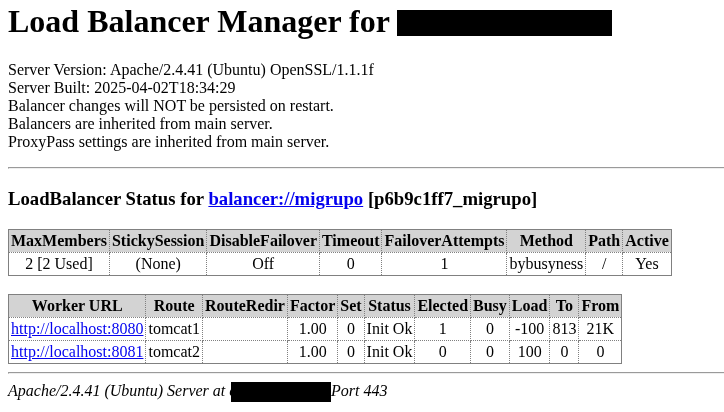

# ACTIVIDAD PRACTICA AVANZADA

## **Balanceo de Carga Dinámico con Apache y Tomcat**

### **Objetivo General**

Implementar un balanceador de carga con **Apache HTTP Server**, configurado con el método **bybusyness**, monitorizado mediante **mod\_status** y **balancer-manager**, distribuyendo las peticiones entre dos instancias de **Apache Tomcat** que funcionan en los puertos `8080` y `8081`. Se realizará una prueba de carga y una sobrecarga dirigida a uno de los Tomcat para comprobar el comportamiento del balanceador.

---

### **Requisitos Previos**

* Apache HTTP Server instalado y configurado con soporte SSL.
* Dos instancias funcionales de Apache Tomcat ejecutándose en los puertos 8080 y 8081.
* Certificados SSL configurados (pueden ser autofirmados).
* DNS o archivo `hosts` apuntando `midominio.com` a tu servidor.
* Tener instalado `ab` (Apache Benchmark) para realizar pruebas de carga.

---

### **Módulos de Apache necesarios**

Verifica que tienes habilitados los siguientes módulos:

* `mod_ssl`
* `mod_proxy`
* `mod_proxy_http`
* `mod_proxy_balancer`
* `mod_lbmethod_bybusyness`
* `mod_status`
* `mod_headers`
* `mod_slotmem_shm`

Puedes habilitarlos con:

```bash
a2enmod ssl proxy proxy_http proxy_balancer lbmethod_bybusyness status headers slotmem_shm heartbeat
```

---

### **Configuración**

Utiliza la siguiente configuración en tu Apache (ajusta rutas y dominios si es necesario):

```apache
<IfModule status_module>
    ExtendedStatus On

    <Location /server-status>
        SetHandler server-status
        Require all granted
    </Location>
</IfModule>

<VirtualHost *:80>
    ServerName midominio.com
    Redirect permanent / https://midominio.com/
</VirtualHost>

<IfModule mod_ssl.c>
<VirtualHost *:443>
    ServerAdmin webmaster@localhost
    ServerName midominio.com

    DocumentRoot /var/www/html

    SSLEngine on
    SSLCertificateFile      /etc/ssl/certs/apache-selfsigned.crt
    SSLCertificateKeyFile   /etc/ssl/private/apache-selfsigned.key

    Header always set X-Frame-Options DENY
    Header always set X-Content-Type-Options nosniff
    Header always set X-XSS-Protection "1; mode=block"
    Header always set X-Forwarded-Proto "https"

    <Proxy "balancer://migrupo">
        BalancerMember http://localhost:8080 route=tomcat1 
        BalancerMember http://localhost:8081 route=tomcat2 
        ProxySet lbmethod=bybusyness
    </Proxy>

    <Location "/balancer-manager">
	    SetHandler balancer-manager
	    Require all granted
    </Location>

    ProxyPass /server-status !
    ProxyPass /balancer-manager !
    ProxyPass / balancer://migrupo/
    ProxyPassReverse / balancer://migrupo/

    LogLevel info proxy_balancer:debug heartbeat:debug

    LogFormat "%h %l %u %t \"%r\" %>s %b %{BALANCER_WORKER_ROUTE}e %{X-Forwarded-For}i" balancerlog
    CustomLog /var/log/apache2/balanceo-carga-ssl-bb.log balancerlog
</VirtualHost>
</IfModule>
```

---

### **Pasos de la Actividad**

#### 1. **Verifica acceso básico**

* Accede a `https://midominio.com/` y comprueba que se muestra el contenido servido por uno de los Tomcat.
* Accede a `https://midominio.com/server-status` y `https://midominio.com/balancer-manager`.

#### 2. **Lanza una prueba de carga sobre el balanceador**

En una terminal, lanza una prueba con Apache Benchmark:

```bash
ab -n 10000 -c 50 https://midominio.com/
```

#### 3. **Simula una sobrecarga en el Tomcat del puerto 8080**

Simultáneamente, abre otra terminal y lanza:

```bash
ab -n 20000 -c 100 http://localhost:8080/
```

Esto generará una sobrecarga directa al Tomcat 1.

---

### **Seguimiento y Evaluación**





Durante las pruebas:

* **Observa en tiempo real** el estado de cada miembro del balanceador en `https://midominio.com/balancer-manager`.
* Comprueba si el balanceador **dirige más tráfico al Tomcat menos cargado** (8081).
* Revisa los logs en `/var/log/apache2/balanceo-carga-ssl-bb.log` para analizar el reparto de peticiones.

---

### **Criterios de Éxito**

* El balanceador distribuye las peticiones inicialmente de forma equitativa.
* Durante la sobrecarga, el método `bybusyness` favorece al Tomcat menos ocupado.
* Se puede observar esta redistribución claramente desde el balancer-manager.
* Logs y estadísticas de `server-status` reflejan la dinámica de carga.


[Vamos al siguiente contenido](./20-L.md)
